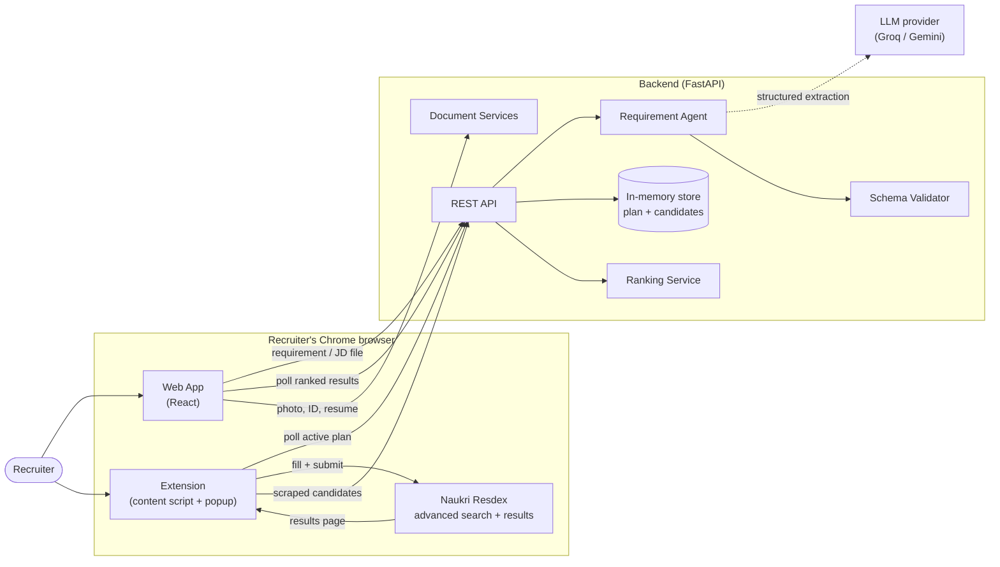
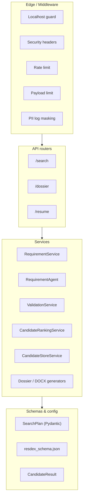
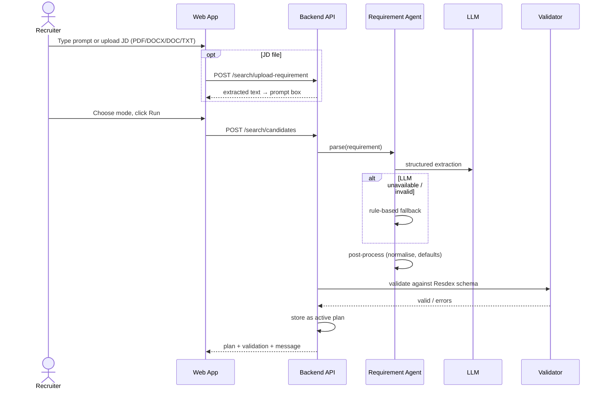
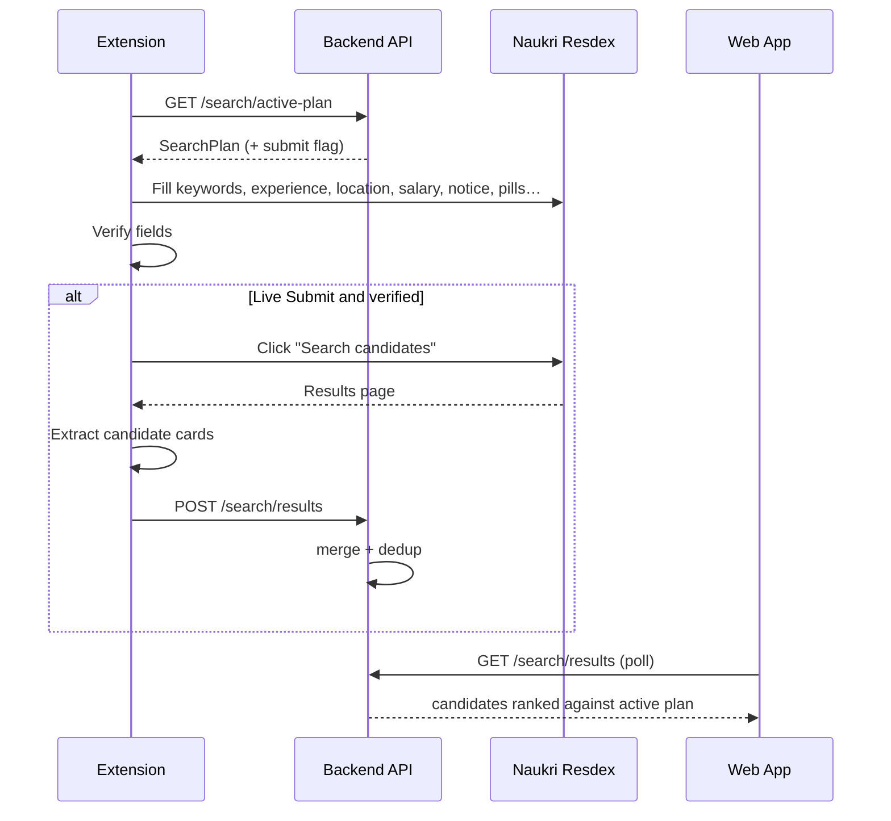

# Profile Bot AI — Technical Documentation

| | |
|---|---|
| **Document version** | 1.0 |
| **Product version** | 1.0 (pilot) |
| **Audience** | Engineers, maintainers, technical reviewers |
| **Status** | Pilot-ready for a single recruiter; not yet production-hardened (see §12) |

## Table of Contents
1. Purpose and Scope
2. System Overview
3. Architecture
4. Components
5. Data Model — the SearchPlan
6. Key Workflows
7. Browser Extension Design
8. API Reference
9. Security and Privacy
10. Deployment and Configuration
11. Testing
12. Known Limitations and Risks
13. Roadmap
14. Glossary

---

## 1. Purpose and Scope
Profile Bot AI automates two recruiter tasks:

1. **Candidate Search Automation** — turns a plain-language requirement (typed, pasted, or extracted from a JD file) into a structured search, fills the Naukri Resdex advanced-search form, submits it, reads the resulting candidates back, and ranks them.
2. **Candidate Dossier Compiler** — combines a candidate photo, ID proof and resume into one formatted `.docx` dossier.

Out of scope for v1: multi-user accounts, persistent storage, pagination across result pages, other job portals.

## 2. System Overview
Three deployable parts communicate over HTTP:

| Part | Tech | Role |
|---|---|---|
| Web app | React + Vite | Recruiter UI: prompt input, JD upload, results view, dossier tool |
| Backend | Python, FastAPI | Requirement parsing, validation, plan hand-off, ranking, document generation |
| Browser extension | Chrome Manifest V3, content script | Runs inside Resdex: fills form, submits search, scrapes results |

## 3. Architecture

### 3.1 System context

### 3.2 Backend layers

## 4. Components

### 4.1 Web app (`frontend/`)
- **Candidates tab** (`SearchAgentView`): prompt box, document upload/drag-drop, execution mode (Dry-Run / Inspection / Live Submit), plan preview, live candidate list with match score and extracted details.
- **Dossier tab** (`dossier-compiler/`): upload workspace and result card.
- Polls `/search/results` while a live run is active.

### 4.2 Backend (`backend/app/`)
| Module | Responsibility |
|---|---|
| `api/search.py` | Plan generation, active-plan hand-off, candidate submit/list/clear, requirement document text extraction |
| `agents/requirement_agent.py` | Two-stage parsing: LLM extraction with deterministic rule-based fallback; post-processing/normalization |
| `services/validation_service.py` | Validates a plan against `resdex_schema.json` allowed options |
| `services/candidate_ranking_service.py` | Explainable 0–100 score + data-completeness per candidate |
| `services/candidate_store_service.py` | Merge/dedup scraped candidates |
| `api/dossier.py`, `services/dossier_service.py`, `docx_resume_generator.py` | Dossier compilation |
| `core/` | Security middleware, DLP masking, file validation, config |

### 4.3 Extension (`extension/`)
- `content.js` — the automation engine (see §7).
- `popup.html` / `popup.js` — manual controls: Auto-Fill, Pause, Resume, Force Re-fill.
- `styles.css` — on-page status widget.

### 4.4 Developer tooling (`tools/`)
- `resdex_recorder.js` — console-pasteable recorder that logs a human's manual form fill (clicks, keys, dropdown contents, form state). Used to derive selectors from real behavior rather than guesses.

## 5. Data Model — the SearchPlan
The SearchPlan is the contract between backend and extension. Main groups:

| Group | Fields |
|---|---|
| Keywords | `required`, `preferred`, `excluded`, `mandatory`, `search_scope` |
| Experience | `min_experience`, `max_experience` |
| Location | `current_location[]`, `include_relocation`, `exclude_anywhere_location` |
| Salary | `salary {currency, min, max, include_unspecified}` |
| Employment (only Notice Period is filled in v1) | `notice_period[]`; designation, department_role, industry, company fields exist in the schema but are skipped by the extension |
| Education | `ug_qualification`, `pg_qualification` |
| Diversity / other | `gender`, `career_break`, `differently_abled`, `defence_background`, `candidate_category`, `candidate_age` |
| Job | `job_type`, `employment_type`, `work_permit[]` |
| Show-only | `verified_mobile`, `verified_email`, `attached_resume`, `candidate_display` |
| Activity | `active_in` |
| Meta | `confidence`, `uncertain_fields[]` |

**Business rules enforced in post-processing**
- Notice period values are normalised to the allowed set; **"Currently serving notice period" is always added** whenever any notice period is present (multi-select).
- Values not explicitly requested (`active_in`, gender, location…) are never invented.
- Keywords marked mandatory when required keywords exist and the flag is unset.

## 6. Key Workflows

### 6.1 Requirement → plan

### 6.2 Plan → Resdex → candidates

### 6.3 Candidate ranking
Weighted, explainable score: skills (45), experience (20), role, location and others. A criterion the plan requires but the candidate data does not provide is reported as **unavailable** and lowers *data completeness* instead of being scored as a miss or fabricated.

## 7. Browser Extension Design

### 7.1 Fill pipeline (ordered steps, each isolated so one failure does not abort the rest)
1. Keywords → 2. Experience → 3. Location → 4. Salary → 5. Employment Details (Notice Period only) → 6. Notice Period → 7. Education → 8. Diversity/other → 9. Show-only pills → 10. Active-in → verify → submit.

### 7.2 Design decisions (derived from recorded human behavior)
| Decision | Reason |
|---|---|
| Resolve dropdown options through the input's `aria-owns`/`aria-controls` list | Generic class-name scans matched stale page content (recent searches, chips) |
| Open a dropdown by click/focus before choosing an option | Naukri only renders options after interaction |
| **Never send Enter; confirm/advance with Tab** | Enter triggers Naukri's form-level "submit search" handler → premature partial search |
| Submit via the dedicated search button only | A generic selector previously hit a *recent-search* link and re-ran an old search |
| Click exact chip elements, never wrapper containers | Wrapper clicks toggled nothing |
| Expand collapsible sections by their header row before touching contents | Collapsed sections do not expose fields |
| Retry suggestion selection for a short window | Listboxes re-render while typing |
| Keep-out list: designation, dept/role, industry, company | Naukri auto-suggests these; filling them over-narrows results |

### 7.3 Result extraction
1. Locate candidate cards (profile-link anchors, else card class fallback).
2. For each card read fields by (a) leaf-most class hint, (b) label/pattern parsing of visible text (`Current:`, `Education:`, `Notice period:`, `Key skills:`, `5 Yrs | … | City`).
3. Send candidates plus **diagnostics** (containers found, per-field hit counts). If key fields are empty a one-time console dump of a card is logged for selector calibration.

### 7.4 Operator controls
Status widget with Pause/Resume; popup with Auto-Fill, Force Re-fill (bypasses the 90 s cooldown).

## 8. API Reference (summary)
| Method & path | Purpose |
|---|---|
| `POST /search/candidates` | NL requirement → validated SearchPlan; stores it |
| `POST /search/plan` | Store a pre-built SearchPlan |
| `GET /search/active-plan` | Extension fetches latest plan |
| `POST /search/upload-requirement` | Extract text from PDF/DOCX/DOC/TXT (≤ 10 MB) |
| `POST /search/results` | Extension submits scraped candidates (≤ 50/batch) |
| `GET /search/results` | Ranked candidates for the UI |
| `DELETE /search/results` | Clear candidates |
| `POST /dossier/…` | Compile photo + ID + resume into `.docx` |
| `GET /health` | Health check |

Interactive docs: `/docs` (Swagger) when the backend runs.

## 9. Security and Privacy
- Localhost guard / DNS-rebinding shield, OWASP security headers, token-bucket rate limiting, payload size limits.
- Uploads: extension allow-list, size cap, magic-byte validation for resumes.
- Real-time PII masking in logs (DLP filter).
- Candidate data held **in memory only**; cleared on restart or via `DELETE /search/results`.
- Extension permissions restricted to `resdex.naukri.com` and the backend hosts.
- **Gap:** plan/candidate endpoints are unauthenticated (see §12).

## 10. Deployment and Configuration
| Item | Detail |
|---|---|
| Backend | `uvicorn app.main:app --port 8001`; hosted on Render (`render.yaml`) |
| Web app | `npm run dev` locally; Vercel/Netlify configs included |
| Extension | Load unpacked from `extension/` at `chrome://extensions`; reload after every change; open a fresh Resdex tab |
| Config | `GROQ_API_KEY`, `GROQ_MODEL`, Gemini key, `ENABLE_DLP_LOG_MASKING`, `APP_VERSION` via environment / `core/config.py` |
| Without LLM keys | System falls back to deterministic rule-based parsing |

## 11. Testing
- Backend: `pytest` suite in `tests/` (schema consistency, ranking, extraction, storage, dossier).
- Extension: manual end-to-end on a real Resdex session; verify against Naukri's *applied filters* panel and results, not only the bot's own logs.
- **Regression note:** changes after the recorder trace (Tab commits, notice chips, section expansion, extractor rewrite) have had a syntax check only — run the full E2E checklist before release.

## 12. Known Limitations and Risks
| # | Item | Impact | Mitigation |
|---|---|---|---|
| 1 | Plan and candidates stored in process memory, global | Single-tenant; data lost on redeploy; users overwrite each other | Per-user sessions + persistent store |
| 2 | No authentication on plan/candidate endpoints | Anyone reaching the host can read/overwrite | Auth token; restrict CORS |
| 3 | Naukri DOM dependency | UI change can break fills silently | Recorder tool, per-step results, diagnostics, monitoring |
| 4 | Results-card selectors are unverified against real markup | Fields may be empty | Use calibration dump to write exact selectors |
| 5 | Synthetic Tab events may not commit every field | Fields left uncommitted | Blur/focus-move fallback; verify via applied filters |
| 6 | Chip "selected" state class unknown | Cannot verify chip toggles | Logged before/after class; then assert |
| 7 | Designation, dept/role, salary not recorded from a human run | Fill paths generic | Second recording session |
| 8 | Single results page only | Incomplete candidate list | Pagination support |
| 9 | Scanned/image PDFs cannot be read | JD upload fails for scans | OCR |
| 10 | Automating a third-party portal | Terms-of-service / account-risk | Business review; keep human-in-loop |

## 13. Roadmap
- **v1.1** Live-verified fill; exact results selectors; unit tests for extractor; commit and tag.
- **v1.2** Auth, per-user sessions, persistent database; JD summariser that shows the condensed prompt in chat before running.
- **v2.0** Pagination, additional portals, analytics, team workspace.

## 14. Glossary
| Term | Meaning |
|---|---|
| Resdex | Naukri's recruiter candidate-search product |
| SearchPlan | Structured JSON describing one search |
| Chip / pill | Clickable option token in the Naukri form |
| Dossier | Combined photo + ID + resume document |
| DLP | Data-leak prevention (masking of personal data in logs) |
